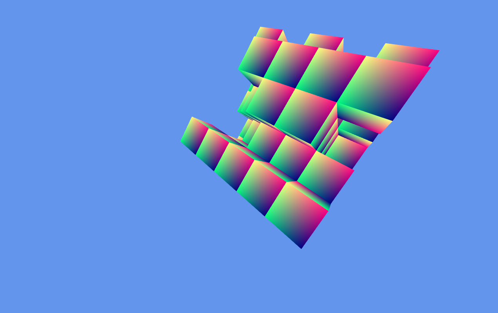

# JS Voxel Engine

This is a simple Voxel Engine made using Javascript and WebGL.

This is currently work in progress. The current project state is below.

Mesh genration code is mostly adapted from https://github.com/Hopson97/HopsonCraft

